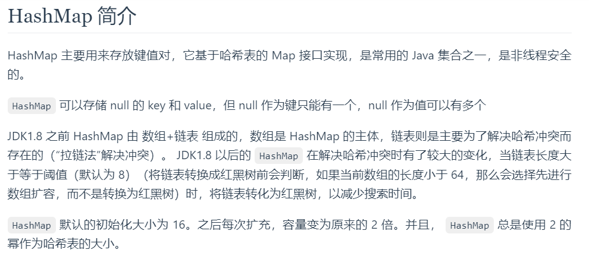

HashMap 主要用来存放键值对,类似C++的map
是常用的JAVA集合之一，是非线程安全的。

什么是线程安全？

线程安全（Thread Safety）是指在多线程编程环境下，程序或系统的组件能够正确地处理多个线程同时访问共享资源的情况，而不会导致不确定的行为或数据不一致的问题。在多线程环境中，多个线程可能会并发地访问和修改共享的数据，如果没有适当的同步机制和保护措施，就可能会出现竞态条件（Race Condition）、死锁（Deadlock）等问题，从而导致程序的运行结果不符合预期。

线程安全的目标是确保在多线程环境中，程序的行为仍然是正确和一致的，不会受到并发访问的干扰。为了实现线程安全，开发人员通常需要采取适当的同步措施，包括使用锁（Locks）、互斥量（Mutex）、信号量（Semaphore）等机制来限制对共享资源的访问，以及避免竞态条件。

在编写多线程程序时，考虑线程安全非常重要，因为不正确的线程管理和同步可能会导致数据损坏、不稳定的行为和难以调试的问题。在设计和实现多线程系统时，开发人员需要充分理解并考虑各种可能的并发情况，以确保程序在多线程环境中能够正确运行并产生可预测的结果。
（From ChatGPT）
